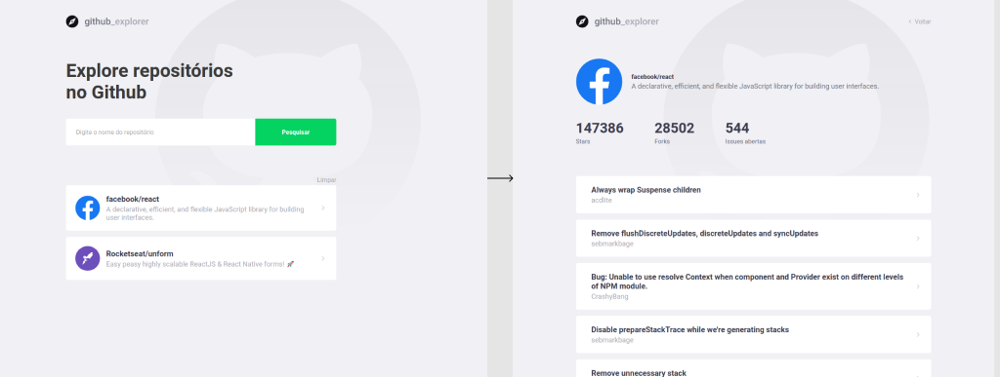

<h1 align="center">
    
</h1>

<h4 align="center">
  ☕ Code and coffee
</h4>
<p align="center">
  

  

  <a href="https://github.com/douglasdeoliveira/github-explorer/commits/master">
    
  </a>

  <a href="https://github.com/douglasdeoliveira/github-explorer/issues">
    
  </a>

</p>

<p align="center">
  <a href="#bookmark-tecnologias">Tecnologias</a>&nbsp;&nbsp;&nbsp;|&nbsp;&nbsp;&nbsp;
  <a href="#-projeto">Projeto</a>&nbsp;&nbsp;&nbsp;|&nbsp;&nbsp;&nbsp;
  <a href="#rocket-como-utilizar">Como utilizar</a>
</p>

<br>

<p align="center">
  
</p>

## :bookmark: Tecnologias

Esse projeto foi desenvolvido com as seguintes tecnologias:

- [React](https://reactjs.org)

## 💻 Projeto

O Github Explorer é um projeto para buscar repositórios do Github e listar suas issues em aberto

## :rocket: Como utilizar

Faça o clone deste repositório:

```
git clone https://github.com/frfontoura/gostack-github-explorer
```

Instale as dependências utilizando:

```
yarn

// or

npm install
```

Inicie o projeto:

```
yarn start

// or

npm start
```

---

Feito com ♥ by Douglas de Oliveira
